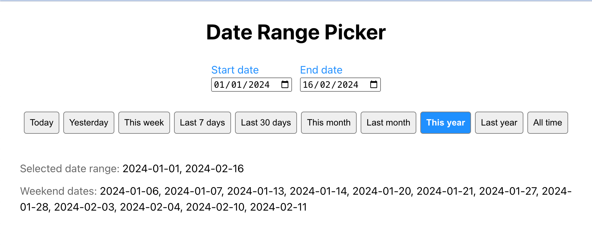

# Weekday Date Range Picker Component



### Overview
The Weekday Date Range Picker Component is a React component developed using TypeScript and Vite. It allows users to select date ranges while ensuring that only weekdays (Monday through Friday) can be selected, excluding weekends (Saturday and Sunday). This component provides a user-friendly interface for selecting date ranges and includes features such as changing the displayed year and month, predefined date ranges, and returning selected date range and weekend dates. This component is developed without relying on any third-party React date picker libraries.


### Features
- Select a date range defined by a start date and an end date.
- Highlight only weekdays in the date picker; weekends are not selectable.
- Change the displayed year and month in the date picker.
- Return the selected date range and any weekend dates within that range using a change handler function.
- Input predefined ranges such as the last 7 days or last 30 days.

# Technologies Used
- ReactJs
- Typescript
- Css
- Vite

# React + TypeScript + Vite

## Install dependencies

`npm install`

## Available Scripts

In the project directory, start the development server:

### `npm run dev`

Runs the app in the development mode.\
Open [http://localhost:5173/](http://localhost:5173/) to view it in the browser.

### Commit Convention
- To ensure readability and consistency in `commit messages`, the conventional commit format is used for writing commit messages that are `clear, concise, and informative`.
- Each commit message should adhere to the following pattern:

```
<type>(<scope>): <description>

[optional body]

[optional footer]

```

Where:

- `<type>` specifies the type of the commit (e.g., feat, fix, chore, docs, style).
- `<scope>` is optional and indicates the scope of the commit (e.g., component name, module).
- `<description>` is a short, concise description of the change.
- `[optional body]` provides additional context or details about the change.
- `[optional footer]` includes any relevant issue or breaking change references.

This convention helps in tracking and understanding the `purpose` of each commit.
See the section about [conventional commits](https://www.conventionalcommits.org/en/v1.0.0/#specification) for more information.

## Live Demo

The application is deployed on Netlify and can be accessed here:
https://date-range-picker-component.netlify.app/